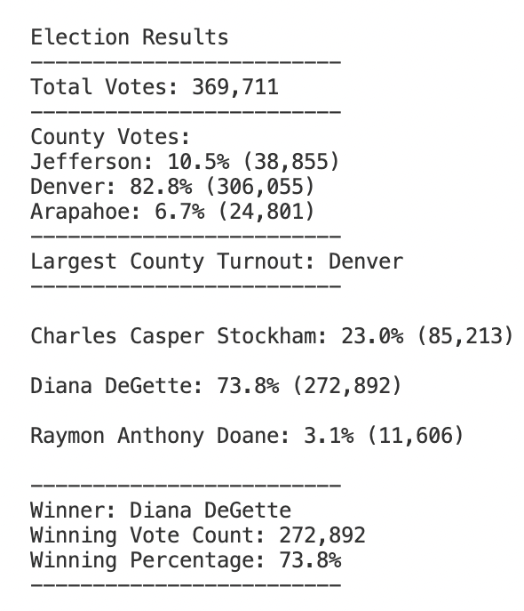

# Election Results Analysis using Python
## Overview of Election Audit

In this challenge, we helped Mr. Tom to analyze election results in election audit in Colorado. We assisted him finding total votes cast, total votes and percentages for each candidate, and the winner of the election. We were also able to report total votes recieved from each county with the percentages.

## Election-Audit Results

- There were **369,711** votes were cast in this election
- Those votes were cast by county:
	- Denver 	**306,055** votes, **82.8%**
	- Jefferson   **38,855**   votes, **10.5%**
	- Arapahoe **24,801** votes, **6.7%**
- County of Denver had the largest number of votes **(306,055)**

- Candidate votes distribution is as following:

	- Charles Casper Stockham **(85,213) 23.0%**

	- Diana DeGette **(272,892) 73.8%**

	- Raymon Anthony Doane **(11,606) 3.1%**

- Diana DeGette won the election **(272,892) 73.8%**

## Election-Audit Summary
This script can be modified if there is more information obtained from voters. Such as age groups, education levels, genders and zip codes to learn about demographics of voters. It can also be modified to find out which candidate received the highest number of votes from each county. 